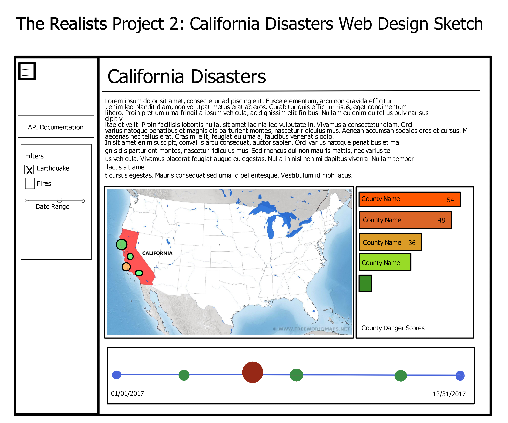

# Project 2 Proposal: California Danger Zones #
## _Presented by_: The Realists ##
### Ali Emily | David Fournie | Janelle Goddard | Kelly Hull ###

We intend to examine the relative safety of different parts of the state of California based on public data documenting earthquake and wildfire activity.

[Wildfire data courtesy of Fire.CA.gov](https://www.fire.ca.gov/incidents/)  
[Earthquake data courtesy of USGS.gov](https://earthquake.usgs.gov/earthquakes/search/)  
_There are no good views of metadata to screencap, unfortunately._  
  
## Inspiring Visualizations ##
As we'll be working with datestamped geoJSON data, we intend to use timeline and map visualizations. We also intend to determine some of the most and least dangerous locations in California and demonstrate their relative safety through visuals, possibly a bar graph.
  
  
  

## Sketch of initial app design ##
  

Repository can be found [here](https://github.com/kehull/Project-2).  

