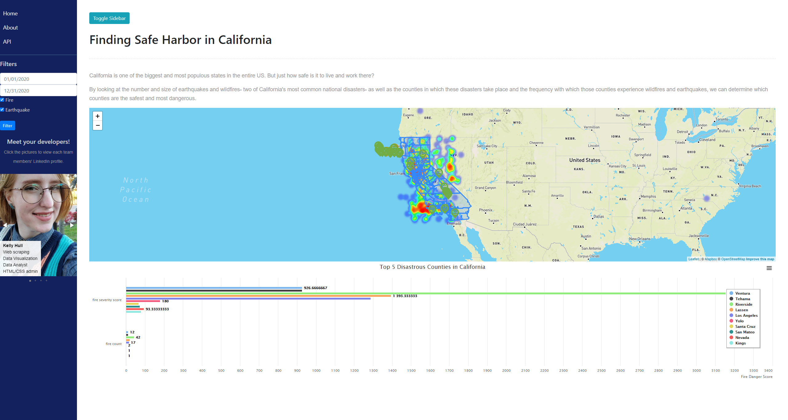

# California Disasters and Habitability
## Project 2
### Kelly Hull, Ali Emily, Janelle Goddard, David Fournie
### 03/24/21
  

## Link
https://california-disasters.herokuapp.com/
  

## Notes on Development and Use

  

## API Documentation
Base: https://california-disasters.herokuapp.com/api/v1.0

To connect to the fire and earthquake databases, simply add "fire" or "earthquake" to the end of the api base.

Example Fire: https://california-disasters.herokuapp.com/api/v1.0/fire
Example Earthquake: https://california-disasters.herokuapp.com/api/v1.0/earthquake

In the fire db, the database can also be queried by county. Simplt add "/county" and county name after the fire query.

Example: https://california-disasters.herokuapp.com/api/v1.0/fire/yuba

Furthermore, the fire db can be queried by date by adding "/date" and "mm-dd-yyyy" after fire. Months 1-9 are single character entries.
Example: https://california-disasters.herokuapp.com/api/v1.0/fire/date/8-3-2020

According to the Natinal Wildfire Coordinating Group, wildfires are classified into seven groups based on how many acres burned.

Class A:"One-fourth acre or less"
Class B:"More than one-fourth acre, but less than 10 acres"
Class C:"10 acres or more, but less than 100 acres"
Class D:"100 acres or more, but less than 300 acres"
Class E:"300 acres or more, but less than 1,000 acres"
Class F:"1,000 acres or more, but less than 5,000 acres"
Class G:"5,000 acres or more"

Source: https://www.nwcg.gov/term/glossary/size-class-of-fire

The Fire database has been designed to query based on these six classes. Simply add "/classification" and the classification letter at the end of the fire query.

Example: https://california-disasters.herokuapp.com/api/v1.0/fire/classification/a

The Earthquake database is queried in similar fashions. To query the database on earthquake magnitude, simply add "/magnitude" and the richter-scale value(1-10) of the earthquake to the earthquake query.

Example: https://california-disasters.herokuapp.com/api/v1.0/earthquake/magnitude/5

Depth has also been included as a query option. Simply add "/depth" and the depth km to the end of earthquake query. Note: km values range from 1 to 28.

Example: https://california-disasters.herokuapp.com/api/v1.0/earthquake/depth/15

Earthquakes are classified both on their magnitude and depth. Earthquake magnitudes are divided into four categories:

Moderate: Magnitude less than 6
Strong: Magnitude 6-7(exclusive)
Major: Magnitude 7-8(exclusive)
Great: Magnitude 8 and above

To query the earthquake database on magnitude classification, simply add "/magnitude/classification" and the classification.

Example:https://california-disasters.herokuapp.com/api/v1.0/earthquake/magnitude/classification/great

Likewise, earthquakes are also categorized by depth. Earthquake depths are divided into three categories from deep(minor earthquake) to shallow(major earthquake). The classes are:

Deep: More than 33km deep
Mid: Between 17km and 33km deep
Shallow: Less than 17 km

To query on depth classification simply add "/depth/classification" and the classification to the earthquake query.

Example:https://california-disasters.herokuapp.com/api/v1.0/earthquake/depth/classification/mid

Happy quering!   

## Website Preview

